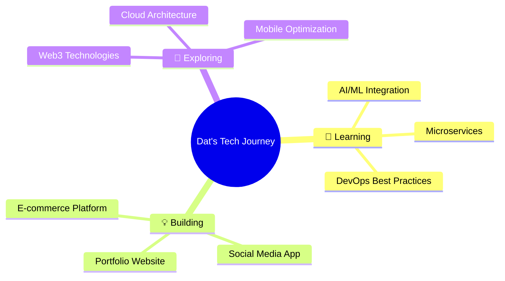

## 📊 **Performance Dashboard**

<div align="center">

### **🚀 Development Metrics**

```ascii
┌─────────────────────────────────────────────────────────────┐
│                    📈 CODING ACTIVITY                       │
├─────────────────────────────────────────────────────────────┤
│ Languages Mastered: 8+     │ Active Projects: 12+          │
│ Years of Experience: 3+     │ Problem Solver: ∞             │
│ Coffee Consumed: ☕☕☕☕    │ Bug Fixed: 🐛➡️✅            │
└─────────────────────────────────────────────────────────────┘
```

### **💡 Innovation Index**

<div align="center">
  
| **Technology Stack** | **Proficiency** | **Projects** | **Impact** |
|---------------------|----------------|--------------|------------|
| 🌐 **Frontend** |  | 15+ | High |
| 📱 **Mobile** |  | 10+ | High |
| ⚙️ **Backend** |  | 12+ | Medium |
| ☁️ **Cloud** |  | 8+ | Growing |

</div>

---

### **🎯 Current Focus Areas**

<div align="center">



</div>

---

### **📈 Growth Trajectory**

<div align="center">

**2024 Achievements** 🏆

| Month | Milestone | Technology |
|-------|-----------|------------|
| 🟢 Q1 | Full-stack E-commerce | React + Node.js |
| 🟡 Q2 | Mobile App Launch | React Native |
| 🔵 Q3 | Cloud Migration | AWS + Docker |
| 🟣 Q4 | DevOps Pipeline | K8s + CI/CD |

</div>

---

### **🛠️ Development Environment**

<div align="center">

```yaml
Developer_Setup:
  OS: "macOS Sonoma / Ubuntu 22.04"
  Editor: "VS Code with 20+ extensions"
  Terminal: "iTerm2 + Oh My Zsh"
  Version_Control: "Git + GitHub"
  Workflow: "Agile + CI/CD"
  Coffee_Level: "Maximum ☕"
```

</div>

---

### **🌟 Project Showcase Matrix**

<div align="center">

| **Project Type** | **Completed** | **In Progress** | **Planned** |
|-----------------|---------------|-----------------|-------------|
| 🌐 Web Apps | 8 ✅ | 2 🔄 | 3 📋 |
| 📱 Mobile Apps | 5 ✅ | 1 🔄 | 2 📋 |
| 🛠️ Tools/Utils | 6 ✅ | 1 🔄 | 1 📋 |
| 🎯 Learning | 12 ✅ | 3 🔄 | 5 📋 |

**Legend:** ✅ Done | 🔄 Active | 📋 Backlog

</div>

---

### **🏅 Skill Constellation**

<div align="center">

```
        🌟 React/React Native
       /                    \
    🌟 JavaScript          🌟 Java/Spring
     |                        |
🌟 Node.js                 🌟 MongoDB
     |                        |
 🌟 AWS/Docker           🌟 Problem Solving
       \                    /
        🌟 Team Collaboration
```

*"Connecting technologies to create amazing experiences"*

</div>
